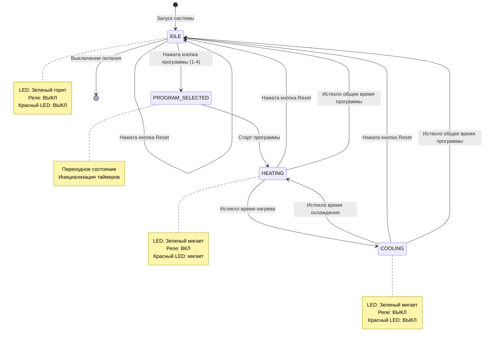
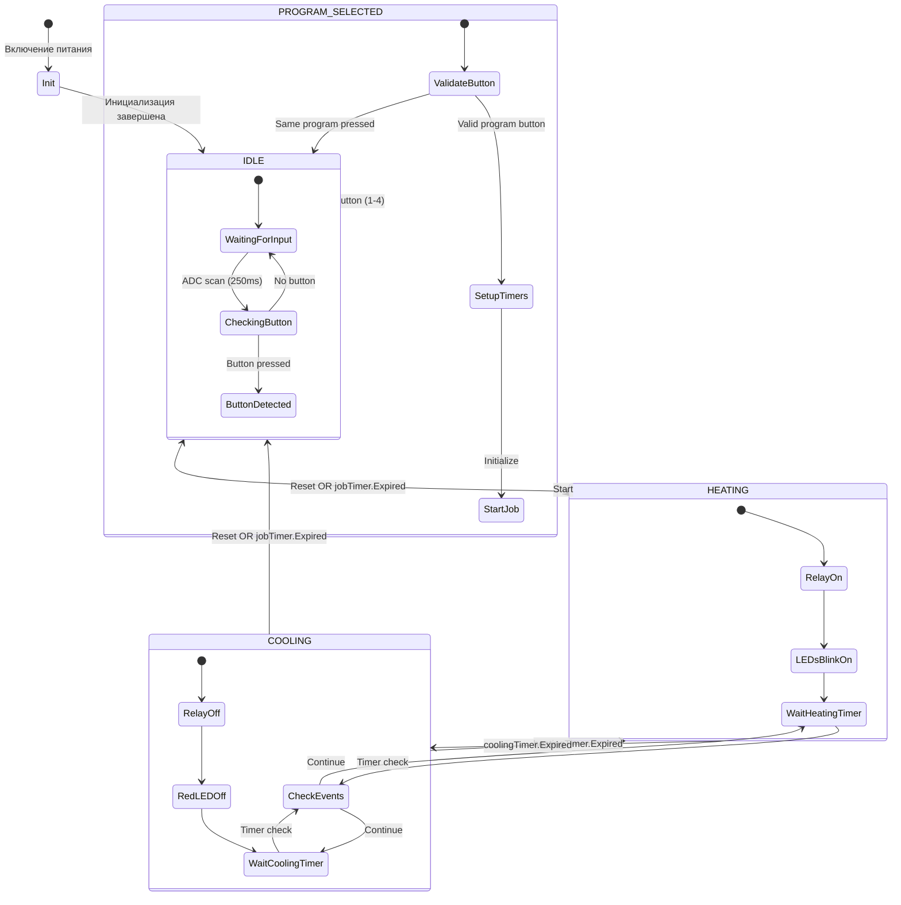
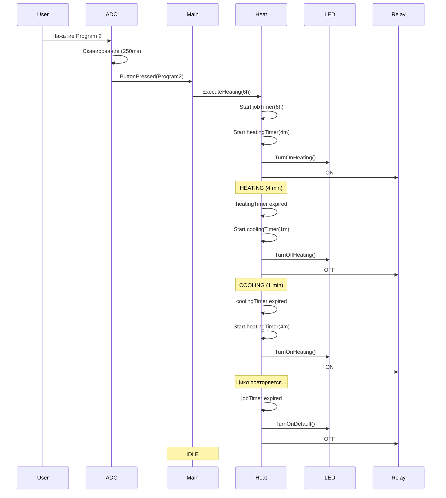

# Алгоритм работы устройства - Конечный автомат

## Диаграмма состояний (State Machine)



## Описание состояний

### 1. IDLE (Ожидание)

**Описание:** Начальное состояние системы. Устройство готово к выбору программы.

**Характеристики:**
- Все таймеры остановлены
- Реле выключено
- Зеленый LED: постоянно горит
- Красный LED: выключен

**Переходы:**
- **→ PROGRAM_SELECTED:** При нажатии кнопки Program 1, 2, 3 или 4
- **→ IDLE:** При нажатии кнопки Reset (остается в том же состоянии)

**Действия при входе:**
```
1. Остановить все таймеры (heating, cooling, job)
2. Выключить реле (GPIO 16 = LOW)
3. Зеленый LED = постоянно ВКЛ
4. Красный LED = ВЫКЛ
5. Сбросить lastDelayValue = 0
```

---

### 2. PROGRAM_SELECTED (Программа выбрана)

**Описание:** Переходное состояние между IDLE и HEATING. Происходит инициализация выбранной программы.

**Характеристики:**
- Кратковременное состояние (практически мгновенное)
- Определяется длительность программы
- Инициализируются таймеры

**Переходы:**
- **→ HEATING:** Автоматический переход после инициализации

**Действия:**
```
1. Определить длительность программы:
   - Program 1: 8 часов (480 минут)
   - Program 2: 6 часов (360 минут)
   - Program 3: 4 часа (240 минут)
   - Program 4: 2 часа (120 минут)
   
2. Запустить jobTimer на выбранную длительность
3. Запустить heatingTimer на 4 минуты
4. Установить lastDelayValue = выбранная длительность
5. Сгенерировать событие HeatingStatus.Heating
```

---

### 3. HEATING (Нагрев)

**Описание:** Активная фаза нагрева. Реле включено, нагревательный элемент работает.

**Характеристики:**
- Реле включено
- Зеленый LED: мигает (500 мс)
- Красный LED: мигает (500 мс)
- Активен heatingTimer (4 минуты)
- Активен jobTimer (общее время программы)

**Переходы:**
- **→ COOLING:** При истечении heatingTimer (4 минуты прошло)
- **→ IDLE:** При нажатии кнопки Reset
- **→ IDLE:** При истечении jobTimer (программа завершена)

**Действия при входе:**
```
1. Включить реле (GPIO 16 = HIGH)
2. Запустить мигание зеленого LED (500 мс)
3. Запустить мигание красного LED (500 мс)
4. Запустить heatingTimer на 4 минуты
5. Вывести в консоль: "Status: Heating"
```

**Действия при выходе:**
```
1. Остановить heatingTimer
```

---

### 4. COOLING (Охлаждение)

**Описание:** Фаза охлаждения. Реле выключено, система отдыхает перед следующим циклом нагрева.

**Характеристики:**
- Реле выключено
- Зеленый LED: мигает (500 мс)
- Красный LED: выключен
- Активен coolingTimer (1 минута)
- Активен jobTimer (общее время программы)

**Переходы:**
- **→ HEATING:** При истечении coolingTimer (1 минута прошла)
- **→ IDLE:** При нажатии кнопки Reset
- **→ IDLE:** При истечении jobTimer (программа завершена)

**Действия при входе:**
```
1. Выключить реле (GPIO 16 = LOW)
2. Продолжить мигание зеленого LED (500 мс)
3. Выключить красный LED
4. Запустить coolingTimer на 1 минуту
5. Вывести в консоль: "Status: Cooling"
```

**Действия при выходе:**
```
1. Остановить coolingTimer
```

---

## Таблица переходов состояний

| Текущее состояние | Событие | Следующее состояние | Действие |
|-------------------|---------|---------------------|----------|
| IDLE | Button Program 1-4 | PROGRAM_SELECTED | Запомнить выбор |
| IDLE | Button Reset | IDLE | Нет действия |
| PROGRAM_SELECTED | Auto | HEATING | Запуск таймеров |
| HEATING | heatingTimer expired | COOLING | Реле OFF |
| HEATING | Button Reset | IDLE | Сброс всех таймеров |
| HEATING | jobTimer expired | IDLE | Завершение программы |
| COOLING | coolingTimer expired | HEATING | Реле ON |
| COOLING | Button Reset | IDLE | Сброс всех таймеров |
| COOLING | jobTimer expired | IDLE | Завершение программы |

---

## Временная диаграмма работы

```
Время:    0    4'   5'   9'   10'  14'  15'  ... [Конец программы]
          |    |    |    |    |    |    |        |
Реле:     ON========OFF==ON========OFF==ON=== ... OFF
          |         |         |         |        |
Heating:  |----4m---|         |----4m---|        |
          |         |         |         |        |
Cooling:            |---1m----|         |---1m---|
          |                                      |
Job:      |------------[Общее время]-------------|

Зеленый:  МИГАЕТ==================================
Красный:  МИГАЕТ====OFF==МИГАЕТ====OFF==МИГАЕТ===OFF
```

### Пример: Программа 2 часа (Production)

```
00:00 - START      → HEATING   (Реле ON, оба LED мигают)
00:04 - 4 мин      → COOLING   (Реле OFF, только зеленый мигает)
00:05 - 5 мин      → HEATING   (Реле ON, оба LED мигают)
00:09 - 9 мин      → COOLING   (Реле OFF, только зеленый мигает)
...
01:55 - 115 мин    → HEATING   (Реле ON, оба LED мигает)
01:59 - 119 мин    → COOLING   (Реле OFF, только зеленый мигает)
02:00 - 120 мин    → IDLE      (Все выключено, зеленый горит)
```

**Итого циклов:** 24 цикла нагрева/охлаждения за 2 часа (по 5 минут каждый цикл)

---

## Расширенная диаграмма с обработкой событий



---

## Псевдокод конечного автомата

```csharp
enum State { IDLE, PROGRAM_SELECTED, HEATING, COOLING }

State currentState = State.IDLE;
ulong selectedProgramDuration = 0;

void StateMachine() {
    switch(currentState) {
        
        case State.IDLE:
            // Вход в состояние
            StopAllTimers();
            RelayOff();
            GreenLED.SolidOn();
            RedLED.Off();
            
            // Обработка событий
            if (ButtonPressed(Program1_4)) {
                selectedProgramDuration = GetProgramDuration(button);
                currentState = State.PROGRAM_SELECTED;
            }
            break;
            
        case State.PROGRAM_SELECTED:
            // Проверка на повторное нажатие
            if (selectedProgramDuration == lastDelayValue) {
                // Игнорировать - та же программа уже запущена
                return;
            }
            
            // Запуск программы
            jobTimer.Start(selectedProgramDuration);
            heatingTimer.Start(HEATING_DURATION);
            lastDelayValue = selectedProgramDuration;
            currentState = State.HEATING;
            break;
            
        case State.HEATING:
            // Вход в состояние
            RelayOn();
            GreenLED.StartBlinking(500ms);
            RedLED.StartBlinking(500ms);
            
            // Обработка событий
            if (heatingTimer.Expired) {
                currentState = State.COOLING;
            }
            else if (ResetPressed || jobTimer.Expired) {
                currentState = State.IDLE;
            }
            break;
            
        case State.COOLING:
            // Вход в состояние
            RelayOff();
            RedLED.Off();
            coolingTimer.Start(COOLING_DURATION);
            
            // Обработка событий
            if (coolingTimer.Expired) {
                currentState = State.HEATING;
            }
            else if (ResetPressed || jobTimer.Expired) {
                currentState = State.IDLE;
            }
            break;
    }
}
```

---

## Защита от ошибок и граничные случаи

### 1. Повторное нажатие той же программы
```
Условие: Программа уже запущена, пользователь нажимает ту же кнопку
Поведение: Игнорировать нажатие (проверка lastDelayValue)
Причина: Избежать сброса таймеров
```

### 2. Нажатие другой программы во время работы
```
Условие: Работает Program 1, нажата Program 2
Поведение: Сброс текущей программы, запуск новой
Действия:
  1. Остановить все таймеры
  2. Перейти в IDLE
  3. Запустить новую программу
```

### 3. Нажатие Reset в любой момент
```
Условие: Reset нажата в HEATING или COOLING
Поведение: Немедленный возврат в IDLE
Действия:
  1. Остановить все таймеры
  2. Выключить реле
  3. Восстановить состояние ожидания
```

### 4. Завершение программы в фазе COOLING
```
Условие: jobTimer истекает во время COOLING
Поведение: Переход в IDLE без возврата в HEATING
Причина: Общий таймер имеет приоритет
```

### 5. Сбой питания
```
Условие: Внезапное отключение питания
Поведение: При включении → переход в IDLE
Последствия: Потеря текущего состояния программы
Решение: Требуется ручной перезапуск программы
```

---

## Метрики производительности

### Время реакции на события
- **Обнаружение кнопки:** 0-250 мс (период сканирования ADC)
- **Переключение реле:** <1 мс
- **Обновление LED:** <1 мс
- **Переход между состояниями:** <10 мс

### Точность таймеров
- **Разрешение:** Микросекунды (μs)
- **Погрешность:** <0.1% (зависит от точности кварца ESP32)
- **Пример:** 4 минуты = 240,000,000 μs ± 240,000 μs (±0.24 сек)

---

## Диаграмма последовательности (Sequence Diagram)



---

Этот конечный автомат обеспечивает надежную и предсказуемую работу устройства во всех возможных сценариях использования.
